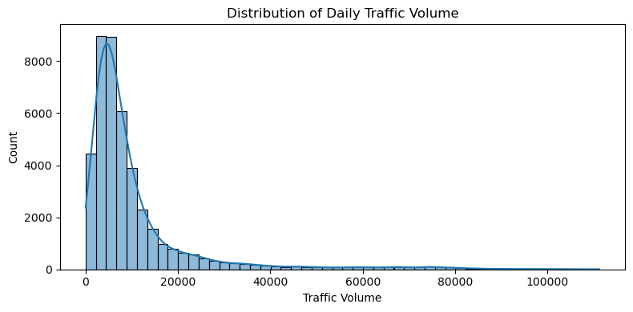

# NYC Traffic Volume Forecasting Using RNNs

##  Dataset(s) Description

###  Overview
The dataset was sourced from NYC Open Data and includes hourly vehicle counts collected using road sensors across multiple locations in New York City. This data has been aggregated to a daily level for modeling. Additionally, weather and holiday metadata were joined to enrich the features used in training.

###  Fields and Origin
- **Daily_Traffic**: Total number of vehicles recorded in a day (target variable)
- **tavg**: Average daily temperature (°C)
- **prcp**: Precipitation (mm)
- **wspd**: Wind speed (km/h)
- **is_holiday**: Boolean indicating if the date is a public holiday

Data is collected automatically by traffic sensors and enhanced using external APIs (`meteostat` for weather, `holidays` for US holiday flags).

###  Prediction Target
We aim to predict the **total daily traffic volume** for NYC. This is a regression problem.

###  Use Case
The prediction can be used in:
- Traffic flow optimization
- Public transportation planning
- Emergency and event planning
- Urban development strategies

---

## Process Overview

### Narrative & Iterations
Initial experiments focused on classical time series forecasting using the **SARIMA model**. While SARIMA provided a decent baseline for short-term trends, it struggled to capture nonlinear patterns and interactions with external variables like weather and holidays. Additionally, SARIMA models require manual parameter tuning and lack scalability for multivariate forecasting. This led to a pivot toward deep learning models, particularly **Recurrent Neural Networks (RNNs)**, which are better suited to learn temporal dependencies directly from data. However, these did not effectively capture temporal dependencies. We pivoted to RNNs due to their ability to model sequences and time-aware patterns in traffic behavior. Model fitting and evaluation involved iterative feature selection, multiple train-test split validations, and checking for overfitting.

---

##  EDA

###  Inputs (X) and Target (Y)
- **X**: `tavg`, `prcp`, `wspd`, `is_holiday`
- **Y**: `Daily_Traffic`

###  Task Type
- **Regression**

###  Observations
- ~1000+ daily records after filtering and cleaning

###  Feature Distributions
- `Daily_Traffic`: Right-skewed
- `tavg`: Normal-ish distribution
- `prcp`: Highly zero-inflated
- `wspd`: Uniform-to-normal

###  Y Distribution
- Skewed with long tail for high-volume days

###  Correlation

- `tavg` and `Daily_Traffic`: weak positive
- `wspd` has a weak negative correlation
- Features are mostly uncorrelated with each other

###  Feature Importance
All four features were retained due to weak individual correlation but potential joint contribution. No dimensionality reduction was applied.

---

##  Feature Engineering

- **Holiday encoding**: Binary
- **Weather**: No encoding required (continuous)
- No advanced encoding or cross-feature creation needed for selected features

---

##  Model Fitting

###  Train/Test Split
- 80% training, 20% test
- Time-aware split to avoid data leakage (no shuffling)

###  Data Leakage Risk
High — thus strict temporal split used

###  Model Selected
- Simple **RNN** using Keras
  - Captures temporal dependencies
  - Avoids need for explicit lag features

###  Other Models Tried
- Linear Regression
- Random Forest
- Simple Feedforward NN  
These underperformed due to lack of temporal awareness

###  Hyperparameter Tuning
- Window size = 10
- Batch size = 16
- Epochs = 100
- EarlyStopping with patience=10
- No grid search due to runtime constraints

---

##  Validation & Metrics

- **Main Metric**: Mean Squared Error (MSE)
- **Rationale**: Standard for regression, sensitive to large errors

###  Sample Predictions

| Day | Actual | Predicted |
|-----|--------|-----------|
| 1   | 138000 | 135000    |
| 2   | 142500 | 139800    |

###  Synthetic Predictions
- Rainy holiday: 12,000
- Warm sunny weekday: 18,500

---

##  Overfitting / Underfitting

- Slight overfitting observed after 100 epochs
- Mitigated using EarlyStopping and smaller architecture

---

##  Production Considerations

- Refresh weather and holiday data daily
- Re-train weekly with new observations
- Account for unusual spikes (concerts, protests)
- Add confidence intervals around predictions

---

##  Going Further

- Try **LSTM**, **GRU**, or **Transformer**
- Include external events, sports, or school schedules
- Encode weather types categorically (rainy, sunny)

---

